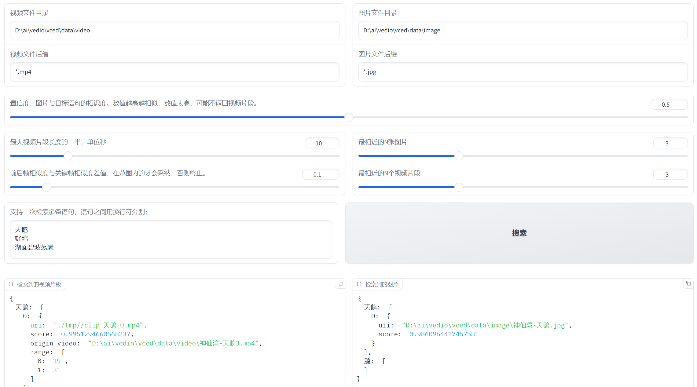

# TEV 
基于给定文本，搜索给定目录下的图片、视频文件，找到相近的图片或视频片段。进而即将检索到的视频片段或图片，裁剪成视频。
- 视频片段&图片检索： 当指定目录时，加载指定目录视频|图片， 并在此目录下进行素材检索；如果未指定视频|图片目录，则在向量库中执行全文检索。
- 视频剪辑：
  - 文本（脚本）与视频相关度较低时（threshold<0.5），检索不到视频。可以尝试降低相关度阈值，或者提供更多相关性视频素材。
  - 文本（脚本）与图片，未作相关度阈值检测，简单返回top-N。
  - 当与文本匹配的视频片段或者图片不足时，系统使用空白（黑色）背景作为填充帧,补足时长。

## install(安装)
### 安装miniconda 或者其他python管理工具


### 创建python（建议3.9版本）环境

```shell
conda create -n tev python=3.9
```

### 安装torch

详情参考[pytorch](https://pytorch.org/)官方。

```shell
pip3 install torch torchvision torchaudio --index-url https://download.pytorch.org/whl/cu118
```

### 安装依赖库

```shell
pip install -r requirements.txt
```

## configuration（配置）

### bert 模型

`demo分支不需要`

### cn_clip 模型

`自动下载，或者`

### voc 模型

`demo分支不需要`

### config.json

- openi: 配置token： 填写你自己的token值

## using



